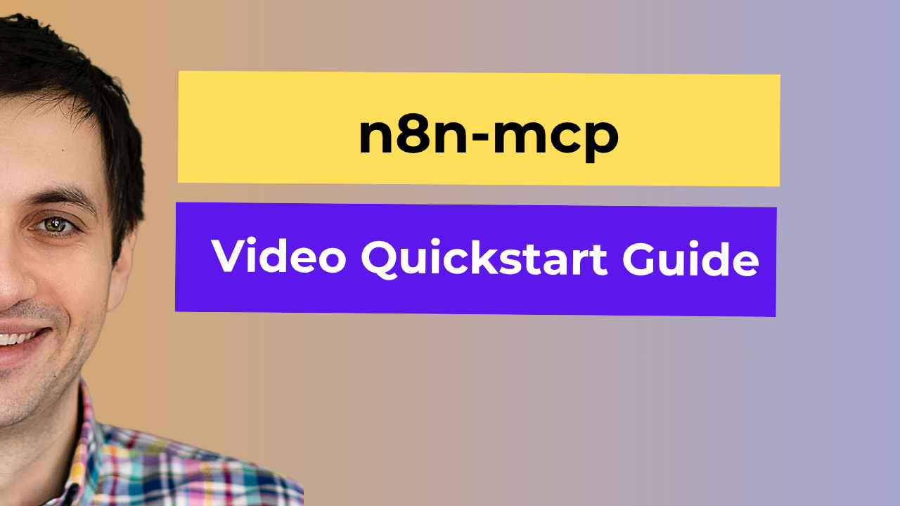

# n8n-MCP

[](https://opensource.org/licenses/MIT)
[](https://github.com/czlonkowski/n8n-mcp)
[](https://github.com/czlonkowski/n8n-mcp)
[](https://www.npmjs.com/package/n8n-mcp)
[](https://codecov.io/gh/czlonkowski/n8n-mcp)
[](https://github.com/czlonkowski/n8n-mcp/actions)
[](https://github.com/n8n-io/n8n)
[](https://github.com/czlonkowski/n8n-mcp/pkgs/container/n8n-mcp)
[](https://railway.com/deploy/n8n-mcp?referralCode=n8n-mcp)

A Model Context Protocol (MCP) server that provides AI assistants with comprehensive access to n8n node documentation, properties, and operations. Deploy in minutes to give Claude and other AI assistants deep knowledge about n8n's 525+ workflow automation nodes.

## Overview

n8n-MCP serves as a bridge between n8n's workflow automation platform and AI models, enabling them to understand and work with n8n nodes effectively. It provides structured access to:

- 📚 **535 n8n nodes** from both n8n-nodes-base and @n8n/n8n-nodes-langchain
- 🔧 **Node properties** - 99% coverage with detailed schemas
- ⚡ **Node operations** - 63.6% coverage of available actions
- 📄 **Documentation** - 90% coverage from official n8n docs (including AI nodes)
- 🤖 **AI tools** - 263 AI-capable nodes detected with full documentation


## ⚠️ Important Safety Warning

**NEVER edit your production workflows directly with AI!** Always:
- 🔄 **Make a copy** of your workflow before using AI tools
- 🧪 **Test in development** environment first
- 💾 **Export backups** of important workflows
- ⚡ **Validate changes** before deploying to production

AI results can be unpredictable. Protect your work!

## 🚀 Quick Start

Get n8n-MCP running in 5 minutes:

[](https://youtu.be/5CccjiLLyaY?si=Z62SBGlw9G34IQnQ&t=343)

### Option 1: npx (Fastest - No Installation!) 🚀

**Prerequisites:** [Node.js](https://nodejs.org/) installed on your system

```bash
# Run directly with npx (no installation needed!)
npx n8n-mcp
```

Add to Claude Desktop config:

**Basic configuration (documentation tools only):**
```json
{
  "mcpServers": {
    "n8n-mcp": {
      "command": "npx",
      "args": ["n8n-mcp"],
      "env": {
        "MCP_MODE": "stdio",
        "LOG_LEVEL": "error",
        "DISABLE_CONSOLE_OUTPUT": "true"
      }
    }
  }
}
```

**Full configuration (with n8n management tools):**
```json
{
  "mcpServers": {
    "n8n-mcp": {
      "command": "npx",
      "args": ["n8n-mcp"],
      "env": {
        "MCP_MODE": "stdio",
        "LOG_LEVEL": "error",
        "DISABLE_CONSOLE_OUTPUT": "true",
        "N8N_API_URL": "https://your-n8n-instance.com",
        "N8N_API_KEY": "your-api-key"
      }
    }
  }
}
```

> **Note**: npx will download and run the latest version automatically. The package includes a pre-built database with all n8n node information.

**Configuration file locations:**
- **macOS**: `~/Library/Application Support/Claude/claude_desktop_config.json`
- **Windows**: `%APPDATA%\Claude\claude_desktop_config.json`
- **Linux**: `~/.config/Claude/claude_desktop_config.json`

**Restart Claude Desktop after updating configuration** - That's it! 🎉

### Option 2: Docker (Easy & Isolated) 🐳

**Prerequisites:** Docker installed on your system

<details>
<summary><strong>📦 Install Docker</strong> (click to expand)</summary>

**macOS:**
```bash
# Using Homebrew
brew install --cask docker

# Or download from https://www.docker.com/products/docker-desktop/
```

**Linux (Ubuntu/Debian):**
```bash
# Update package index
sudo apt-get update

# Install Docker
sudo apt-get install docker.io

# Start Docker service
sudo systemctl start docker
sudo systemctl enable docker

# Add your user to docker group (optional, to run without sudo)
sudo usermod -aG docker $USER
# Log out and back in for this to take effect
```

**Windows:**
```bash
# Option 1: Using winget (Windows Package Manager)
winget install Docker.DockerDesktop

# Option 2: Using Chocolatey
choco install docker-desktop

# Option 3: Download installer from https://www.docker.com/products/docker-desktop/
```

**Verify installation:**
```bash
docker --version
```
</details>

```bash
# Pull the Docker image (~280MB, no n8n dependencies!)
docker pull ghcr.io/czlonkowski/n8n-mcp:latest
```

> **⚡ Ultra-optimized:** Our Docker image is 82% smaller than typical n8n images because it contains NO n8n dependencies - just the runtime MCP server with a pre-built database!

Add to Claude Desktop config:

**Basic configuration (documentation tools only):**
```json
{
  "mcpServers": {
    "n8n-mcp": {
      "command": "docker",
      "args": [
        "run",
        "-i",
        "--rm",
        "--init",
        "-e", "MCP_MODE=stdio",
        "-e", "LOG_LEVEL=error",
        "-e", "DISABLE_CONSOLE_OUTPUT=true",
        "ghcr.io/czlonkowski/n8n-mcp:latest"
      ]
    }
  }
}
```

**Full configuration (with n8n management tools):**
```json
{
  "mcpServers": {
    "n8n-mcp": {
      "command": "docker",
      "args": [
        "run",
        "-i",
        "--rm",
        "--init",
        "-e", "MCP_MODE=stdio",
        "-e", "LOG_LEVEL=error",
        "-e", "DISABLE_CONSOLE_OUTPUT=true",
        "-e", "N8N_API_URL=https://your-n8n-instance.com",
        "-e", "N8N_API_KEY=your-api-key",
        "ghcr.io/czlonkowski/n8n-mcp:latest"
      ]
    }
  }
}
```

>💡 Tip: If you’re running n8n locally on the same machine (e.g., via Docker), use http://host.docker.internal:5678 as the N8N_API_URL.

> **Note**: The n8n API credentials are optional. Without them, you'll have access to all documentation and validation tools. With them, you'll additionally get workflow management capabilities (create, update, execute workflows).

**Important:** The `-i` flag is required for MCP stdio communication.

> 🔧 If you encounter any issues with Docker, check our [Docker Troubleshooting Guide](./docs/DOCKER_TROUBLESHOOTING.md).

**Configuration file locations:**
- **macOS**: `~/Library/Application Support/Claude/claude_desktop_config.json`
- **Windows**: `%APPDATA%\Claude\claude_desktop_config.json`
- **Linux**: `~/.config/Claude/claude_desktop_config.json`

**Restart Claude Desktop after updating configuration** - That's it! 🎉

## 💖 Support This Project

<div align="center">
  <a href="https://github.com/sponsors/czlonkowski">
    
  </a>
</div>

**n8n-mcp** started as a personal tool but now helps tens of thousands of developers automate their workflows efficiently. Maintaining and developing this project competes with my paid work.

Your sponsorship helps me:
- 🚀 Dedicate focused time to new features
- 🐛 Respond quickly to issues
- 📚 Keep documentation up-to-date
- 🔄 Ensure compatibility with latest n8n releases

Every sponsorship directly translates to hours invested in making n8n-mcp better for everyone. **[Become a sponsor →](https://github.com/sponsors/czlonkowski)**

---

### Option 3: Local Installation (For Development)

**Prerequisites:** [Node.js](https://nodejs.org/) installed on your system

```bash
# 1. Clone and setup
git clone https://github.com/czlonkowski/n8n-mcp.git
cd n8n-mcp
npm install
npm run build
npm run rebuild

# 2. Test it works
npm start
```

Add to Claude Desktop config:

**Basic configuration (documentation tools only):**
```json
{
  "mcpServers": {
    "n8n-mcp": {
      "command": "node",
      "args": ["/absolute/path/to/n8n-mcp/dist/mcp/index.js"],
      "env": {
        "MCP_MODE": "stdio",
        "LOG_LEVEL": "error",
        "DISABLE_CONSOLE_OUTPUT": "true"
      }
    }
  }
}
```

**Full configuration (with n8n management tools):**
```json
{
  "mcpServers": {
    "n8n-mcp": {
      "command": "node",
      "args": ["/absolute/path/to/n8n-mcp/dist/mcp/index.js"],
      "env": {
        "MCP_MODE": "stdio",
        "LOG_LEVEL": "error",
        "DISABLE_CONSOLE_OUTPUT": "true",
        "N8N_API_URL": "https://your-n8n-instance.com",
        "N8N_API_KEY": "your-api-key"
      }
    }
  }
}
```

> **Note**: The n8n API credentials can be configured either in a `.env` file (create from `.env.example`) or directly in the Claude config as shown above.

> 💡 Tip: If you’re running n8n locally on the same machine (e.g., via Docker), use http://host.docker.internal:5678 as the N8N_API_URL.

### Option 4: Railway Cloud Deployment (One-Click Deploy) ☁️

**Prerequisites:** Railway account (free tier available)

Deploy n8n-MCP to Railway's cloud platform with zero configuration:

[](https://railway.com/deploy/n8n-mcp?referralCode=n8n-mcp)

**Benefits:**
- ☁️ **Instant cloud hosting** - No server setup required
- 🔒 **Secure by default** - HTTPS included, auth token warnings
- 🌐 **Global access** - Connect from any Claude Desktop
- ⚡ **Auto-scaling** - Railway handles the infrastructure
- 📊 **Built-in monitoring** - Logs and metrics included

**Quick Setup:**
1. Click the "Deploy on Railway" button above
2. Sign in to Railway (or create a free account)
3. Configure your deployment (project name, region)
4. Click "Deploy" and wait ~2-3 minutes
5. Copy your deployment URL and auth token
6. Add to Claude Desktop config using the HTTPS URL

> 📚 **For detailed setup instructions, troubleshooting, and configuration examples, see our [Railway Deployment Guide](./docs/RAILWAY_DEPLOYMENT.md)**

**Configuration file locations:**
- **macOS**: `~/Library/Application Support/Claude/claude_desktop_config.json`
- **Windows**: `%APPDATA%\Claude\claude_desktop_config.json`
- **Linux**: `~/.config/Claude/claude_desktop_config.json`

**Restart Claude Desktop after updating configuration** - That's it! 🎉

## 🔧 n8n Integration

Want to use n8n-MCP with your n8n instance? Check out our comprehensive [n8n Deployment Guide](./docs/N8N_DEPLOYMENT.md) for:
- Local testing with the MCP Client Tool node
- Production deployment with Docker Compose
- Cloud deployment on Hetzner, AWS, and other providers
- Troubleshooting and security best practices

## 💻 Connect your IDE

n8n-MCP works with multiple AI-powered IDEs and tools. Choose your preferred development environment:

### [Claude Code](./docs/CLAUDE_CODE_SETUP.md)
Quick setup for Claude Code CLI - just type "add this mcp server" and paste the config.

### [Visual Studio Code](./docs/VS_CODE_PROJECT_SETUP.md)
Full setup guide for VS Code with GitHub Copilot integration and MCP support.

### [Cursor](./docs/CURSOR_SETUP.md)
Step-by-step tutorial for connecting n8n-MCP to Cursor IDE with custom rules.

### [Windsurf](./docs/WINDSURF_SETUP.md)
Complete guide for integrating n8n-MCP with Windsurf using project rules.

## 🤖 Claude Project Setup

For the best results when using n8n-MCP with Claude Projects, use these enhanced system instructions:

```markdown
You are an expert in n8n automation software using n8n-MCP tools. Your role is to design, build, and validate n8n workflows with maximum accuracy and efficiency.

## Core Workflow Process

1. **ALWAYS start new conversation with**: `tools_documentation()` to understand best practices and available tools.

2. **Discovery Phase** - Find the right nodes:
   - Think deeply about user request and the logic you are going to build to fulfill it. Ask follow-up questions to clarify the user's intent, if something is unclear. Then, proceed with the rest of your instructions.
   - `search_nodes({query: 'keyword'})` - Search by functionality
   - `list_nodes({category: 'trigger'})` - Browse by category
   - `list_ai_tools()` - See AI-capable nodes (remember: ANY node can be an AI tool!)

3. **Configuration Phase** - Get node details efficiently:
   - `get_node_essentials(nodeType)` - Start here! Only 10-20 essential properties
   - `search_node_properties(nodeType, 'auth')` - Find specific properties
   - `get_node_for_task('send_email')` - Get pre-configured templates
   - `get_node_documentation(nodeType)` - Human-readable docs when needed
   - It is good common practice to show a visual representation of the workflow architecture to the user and asking for opinion, before moving forward. 

4. **Pre-Validation Phase** - Validate BEFORE building:
   - `validate_node_minimal(nodeType, config)` - Quick required fields check
   - `validate_node_operation(nodeType, config, profile)` - Full operation-aware validation
   - Fix any validation errors before proceeding

5. **Building Phase** - Create the workflow:
   - Use validated configurations from step 4
   - Connect nodes with proper structure
   - Add error handling where appropriate
   - Use expressions like $json, $node["NodeName"].json
   - Build the workflow in an artifact for easy editing downstream (unless the user asked to create in n8n instance)

6. **Workflow Validation Phase** - Validate complete workflow:
   - `validate_workflow(workflow)` - Complete validation including connections
   - `validate_workflow_connections(workflow)` - Check structure and AI tool connections
   - `validate_workflow_expressions(workflow)` - Validate all n8n expressions
   - Fix any issues found before deployment

7. **Deployment Phase** (if n8n API configured):
   - `n8n_create_workflow(workflow)` - Deploy validated workflow
   - `n8n_validate_workflow({id: 'workflow-id'})` - Post-deployment validation
   - `n8n_update_partial_workflow()` - Make incremental updates using diffs
   - `n8n_trigger_webhook_workflow()` - Test webhook workflows

## Key Insights

- **USE CODE NODE ONLY WHEN IT IS NECESSARY** - always prefer to use standard nodes over code node. Use code node only when you are sure you need it.
- **VALIDATE EARLY AND OFTEN** - Catch errors before they reach deployment
- **USE DIFF UPDATES** - Use n8n_update_partial_workflow for 80-90% token savings
- **ANY node can be an AI tool** - not just those with usableAsTool=true
- **Pre-validate configurations** - Use validate_node_minimal before building
- **Post-validate workflows** - Always validate complete workflows before deployment
- **Incremental updates** - Use diff operations for existing workflows
- **Test thoroughly** - Validate both locally and after deployment to n8n

## Validation Strategy

### Before Building:
1. validate_node_minimal() - Check required fields
2. validate_node_operation() - Full configuration validation
3. Fix all errors before proceeding

### After Building:
1. validate_workflow() - Complete workflow validation
2. validate_workflow_connections() - Structure validation
3. validate_workflow_expressions() - Expression syntax check

### After Deployment:
1. n8n_validate_workflow({id}) - Validate deployed workflow
2. n8n_list_executions() - Monitor execution status
3. n8n_update_partial_workflow() - Fix issues using diffs

## Response Structure

1. **Discovery**: Show available nodes and options
2. **Pre-Validation**: Validate node configurations first
3. **Configuration**: Show only validated, working configs
4. **Building**: Construct workflow with validated components
5. **Workflow Validation**: Full workflow validation results
6. **Deployment**: Deploy only after all validations pass
7. **Post-Validation**: Verify deployment succeeded

## Example Workflow

### 1. Discovery & Configuration
search_nodes({query: 'slack'})
get_node_essentials('n8n-nodes-base.slack')

### 2. Pre-Validation
validate_node_minimal('n8n-nodes-base.slack', {resource:'message', operation:'send'})
validate_node_operation('n8n-nodes-base.slack', fullConfig, 'runtime')

### 3. Build Workflow
// Create workflow JSON with validated configs

### 4. Workflow Validation
validate_workflow(workflowJson)
validate_workflow_connections(workflowJson)
validate_workflow_expressions(workflowJson)

### 5. Deploy (if configured)
n8n_create_workflow(validatedWorkflow)
n8n_validate_workflow({id: createdWorkflowId})

### 6. Update Using Diffs
n8n_update_partial_workflow({
  workflowId: id,
  operations: [
    {type: 'updateNode', nodeId: 'slack1', changes: {position: [100, 200]}}
  ]
})

## Important Rules

- ALWAYS validate before building
- ALWAYS validate after building
- NEVER deploy unvalidated workflows
- USE diff operations for updates (80-90% token savings)
- STATE validation results clearly
- FIX all errors before proceeding
```

Save these instructions in your Claude Project for optimal n8n workflow assistance with comprehensive validation.

## 🚨 Important: Sharing Guidelines

This project is MIT licensed and free for everyone to use. However:

- **✅ DO**: Share this repository freely with proper attribution
- **✅ DO**: Include a direct link to https://github.com/czlonkowski/n8n-mcp in your first post/video
- **❌ DON'T**: Gate this free tool behind engagement requirements (likes, follows, comments)
- **❌ DON'T**: Use this project for engagement farming on social media

This tool was created to benefit everyone in the n8n community without friction. Please respect the MIT license spirit by keeping it accessible to all.

## Features

- **🔍 Smart Node Search**: Find nodes by name, category, or functionality
- **📖 Essential Properties**: Get only the 10-20 properties that matter (NEW in v2.4.0)
- **🎯 Task Templates**: Pre-configured settings for common automation tasks
- **✅ Config Validation**: Validate node configurations before deployment
- **🔗 Dependency Analysis**: Understand property relationships and conditions
- **💡 Working Examples**: Real-world examples for immediate use
- **⚡ Fast Response**: Average query time ~12ms with optimized SQLite
- **🌐 Universal Compatibility**: Works with any Node.js version

## 💬 Why n8n-MCP? A Testimonial from Claude

> *"Before MCP, I was translating. Now I'm composing. And that changes everything about how we can build automation."*

When Claude, Anthropic's AI assistant, tested n8n-MCP, the results were transformative:

**Without MCP:** "I was basically playing a guessing game. 'Is it `scheduleTrigger` or `schedule`? Does it take `interval` or `rule`?' I'd write what seemed logical, but n8n has its own conventions that you can't just intuit. I made six different configuration errors in a simple HackerNews scraper."

**With MCP:** "Everything just... worked. Instead of guessing, I could ask `get_node_essentials()` and get exactly what I needed - not a 100KB JSON dump, but the actual 5-10 properties that matter. What took 45 minutes now takes 3 minutes."

**The Real Value:** "It's about confidence. When you're building automation workflows, uncertainty is expensive. One wrong parameter and your workflow fails at 3 AM. With MCP, I could validate my configuration before deployment. That's not just time saved - that's peace of mind."

[Read the full interview →](docs/CLAUDE_INTERVIEW.md)

## 📡 Available MCP Tools

Once connected, Claude can use these powerful tools:

### Core Tools
- **`tools_documentation`** - Get documentation for any MCP tool (START HERE!)
- **`list_nodes`** - List all n8n nodes with filtering options
- **`get_node_info`** - Get comprehensive information about a specific node
- **`get_node_essentials`** - Get only essential properties with examples (10-20 properties instead of 200+)
- **`search_nodes`** - Full-text search across all node documentation
- **`search_node_properties`** - Find specific properties within nodes
- **`list_ai_tools`** - List all AI-capable nodes (ANY node can be used as AI tool!)
- **`get_node_as_tool_info`** - Get guidance on using any node as an AI tool

### Advanced Tools
- **`get_node_for_task`** - Pre-configured node settings for common tasks
- **`list_tasks`** - Discover available task templates
- **`validate_node_operation`** - Validate node configurations (operation-aware, profiles support)
- **`validate_node_minimal`** - Quick validation for just required fields
- **`validate_workflow`** - Complete workflow validation including AI tool connections
- **`validate_workflow_connections`** - Check workflow structure and AI tool connections
- **`validate_workflow_expressions`** - Validate n8n expressions including $fromAI()
- **`get_property_dependencies`** - Analyze property visibility conditions
- **`get_node_documentation`** - Get parsed documentation from n8n-docs
- **`get_database_statistics`** - View database metrics and coverage

### n8n Management Tools (Optional - Requires API Configuration)
These powerful tools allow you to manage n8n workflows directly from Claude. They're only available when you provide `N8N_API_URL` and `N8N_API_KEY` in your configuration.

#### Workflow Management
- **`n8n_create_workflow`** - Create new workflows with nodes and connections
- **`n8n_get_workflow`** - Get complete workflow by ID
- **`n8n_get_workflow_details`** - Get workflow with execution statistics
- **`n8n_get_workflow_structure`** - Get simplified workflow structure
- **`n8n_get_workflow_minimal`** - Get minimal workflow info (ID, name, active status)
- **`n8n_update_full_workflow`** - Update entire workflow (complete replacement)
- **`n8n_update_partial_workflow`** - Update workflow using diff operations (NEW in v2.7.0!)
- **`n8n_delete_workflow`** - Delete workflows permanently
- **`n8n_list_workflows`** - List workflows with filtering and pagination
- **`n8n_validate_workflow`** - Validate workflows already in n8n by ID (NEW in v2.6.3)

#### Execution Management
- **`n8n_trigger_webhook_workflow`** - Trigger workflows via webhook URL
- **`n8n_get_execution`** - Get execution details by ID
- **`n8n_list_executions`** - List executions with status filtering
- **`n8n_delete_execution`** - Delete execution records

#### System Tools
- **`n8n_health_check`** - Check n8n API connectivity and features
- **`n8n_diagnostic`** - Troubleshoot management tools visibility and configuration issues
- **`n8n_list_available_tools`** - List all available management tools

### Example Usage

```typescript
// Get essentials for quick configuration
get_node_essentials("nodes-base.httpRequest")

// Find nodes for a specific task
search_nodes({ query: "send email gmail" })

// Get pre-configured settings
get_node_for_task("send_email")

// Validate before deployment
validate_node_operation({
  nodeType: "nodes-base.httpRequest",
  config: { method: "POST", url: "..." },
  profile: "runtime" // or "minimal", "ai-friendly", "strict"
})

// Quick required field check
validate_node_minimal({
  nodeType: "nodes-base.slack",
  config: { resource: "message", operation: "send" }
})
```

## 💻 Local Development Setup

For contributors and advanced users:

**Prerequisites:**
- [Node.js](https://nodejs.org/) (any version - automatic fallback if needed)
- npm or yarn
- Git

```bash
# 1. Clone the repository
git clone https://github.com/czlonkowski/n8n-mcp.git
cd n8n-mcp

# 2. Clone n8n docs (optional but recommended)
git clone https://github.com/n8n-io/n8n-docs.git ../n8n-docs

# 3. Install and build
npm install
npm run build

# 4. Initialize database
npm run rebuild

# 5. Start the server
npm start          # stdio mode for Claude Desktop
npm run start:http # HTTP mode for remote access
```

### Development Commands

```bash
# Build & Test
npm run build          # Build TypeScript
npm run rebuild        # Rebuild node database
npm run test-nodes     # Test critical nodes
npm run validate       # Validate node data
npm test               # Run all tests

# Update Dependencies
npm run update:n8n:check  # Check for n8n updates
npm run update:n8n        # Update n8n packages

# Run Server
npm run dev            # Development with auto-reload
npm run dev:http       # HTTP dev mode
```

## 📚 Documentation

### Setup Guides
- [Installation Guide](./docs/INSTALLATION.md) - Comprehensive installation instructions
- [Claude Desktop Setup](./docs/README_CLAUDE_SETUP.md) - Detailed Claude configuration
- [Docker Guide](./docs/DOCKER_README.md) - Advanced Docker deployment options
- [MCP Quick Start](./docs/MCP_QUICK_START_GUIDE.md) - Get started quickly with n8n-MCP

### Feature Documentation
- [Workflow Diff Operations](./docs/workflow-diff-examples.md) - Token-efficient workflow updates (NEW!)
- [Transactional Updates](./docs/transactional-updates-example.md) - Two-pass workflow editing
- [MCP Essentials](./docs/MCP_ESSENTIALS_README.md) - AI-optimized tools guide
- [Validation System](./docs/validation-improvements-v2.4.2.md) - Smart validation profiles

### Development & Deployment
- [Railway Deployment](./docs/RAILWAY_DEPLOYMENT.md) - One-click cloud deployment guide
- [HTTP Deployment](./docs/HTTP_DEPLOYMENT.md) - Remote server setup guide
- [Dependency Management](./docs/DEPENDENCY_UPDATES.md) - Keeping n8n packages in sync
- [Claude's Interview](./docs/CLAUDE_INTERVIEW.md) - Real-world impact of n8n-MCP

### Project Information
- [Change Log](./CHANGELOG.md) - Complete version history
- [Claude Instructions](./CLAUDE.md) - AI guidance for this codebase
- [MCP Tools Reference](#-available-mcp-tools) - Complete list of available tools

## 📊 Metrics & Coverage

Current database coverage (n8n v1.106.3):

- ✅ **535/535** nodes loaded (100%)
- ✅ **528** nodes with properties (98.7%)
- ✅ **470** nodes with documentation (88%)
- ✅ **267** AI-capable tools detected
- ✅ **AI Agent & LangChain nodes** fully documented
- ⚡ **Average response time**: ~12ms
- 💾 **Database size**: ~15MB (optimized)

## 🔄 Recent Updates

See [CHANGELOG.md](./docs/CHANGELOG.md) for full version history and recent changes.

## ⚠️ Known Issues

### Claude Desktop Container Management

#### Container Accumulation (Fixed in v2.7.20+)
Previous versions had an issue where containers would not properly clean up when Claude Desktop sessions ended. This has been fixed in v2.7.20+ with proper signal handling.

**For best container lifecycle management:**
1. **Use the --init flag** (recommended) - Docker's init system ensures proper signal handling:
```json
{
  "mcpServers": {
    "n8n-mcp": {
      "command": "docker",
      "args": [
        "run", "-i", "--rm", "--init",
        "ghcr.io/czlonkowski/n8n-mcp:latest"
      ]
    }
  }
}
```

2. **Ensure you're using v2.7.20 or later** - Check your version:
```bash
docker run --rm ghcr.io/czlonkowski/n8n-mcp:latest --version
```


## 🧪 Testing

The project includes a comprehensive test suite with **1,356 tests** ensuring code quality and reliability:

```bash
# Run all tests
npm test

# Run tests with coverage report
npm run test:coverage

# Run tests in watch mode
npm run test:watch

# Run specific test suites
npm run test:unit           # 933 unit tests
npm run test:integration    # 249 integration tests
npm run test:bench          # Performance benchmarks
```

### Test Suite Overview

- **Total Tests**: 1,356 (100% passing)
  - **Unit Tests**: 1,107 tests across 44 files
  - **Integration Tests**: 249 tests across 14 files
- **Execution Time**: ~2.5 minutes in CI
- **Test Framework**: Vitest (for speed and TypeScript support)
- **Mocking**: MSW for API mocking, custom mocks for databases

### Coverage & Quality

- **Coverage Reports**: Generated in `./coverage` directory
- **CI/CD**: Automated testing on all PRs with GitHub Actions
- **Performance**: Environment-aware thresholds for CI vs local
- **Parallel Execution**: Configurable thread pool for faster runs

### Testing Architecture

- **Unit Tests**: Isolated component testing with mocks
  - Services layer: ~450 tests
  - Parsers: ~200 tests
  - Database repositories: ~100 tests
  - MCP tools: ~180 tests

- **Integration Tests**: Full system behavior validation
  - MCP Protocol compliance: 72 tests
  - Database operations: 89 tests
  - Error handling: 44 tests
  - Performance: 44 tests

- **Benchmarks**: Performance testing for critical paths
  - Database queries
  - Node loading
  - Search operations

For detailed testing documentation, see [Testing Architecture](./docs/testing-architecture.md).

## 📦 License

MIT License - see [LICENSE](LICENSE) for details.

**Attribution appreciated!** If you use n8n-MCP, consider:
- ⭐ Starring this repository
- 💬 Mentioning it in your project
- 🔗 Linking back to this repo


## 🤝 Contributing

Contributions are welcome! Please:
1. Fork the repository
2. Create a feature branch
3. Run tests (`npm test`)
4. Submit a pull request

### 🚀 For Maintainers: Automated Releases

This project uses automated releases triggered by version changes:

```bash
# Guided release preparation
npm run prepare:release

# Test release automation
npm run test:release-automation
```

The system automatically handles:
- 🏷️ GitHub releases with changelog content
- 📦 NPM package publishing
- 🐳 Multi-platform Docker images
- 📚 Documentation updates

See [Automated Release Guide](./docs/AUTOMATED_RELEASES.md) for complete details.

## 👏 Acknowledgments

- [n8n](https://n8n.io) team for the workflow automation platform
- [Anthropic](https://anthropic.com) for the Model Context Protocol
- All contributors and users of this project

---

<div align="center">
  <strong>Built with ❤️ for the n8n community</strong><br>
  <sub>Making AI + n8n workflow creation delightful</sub>
</div>
