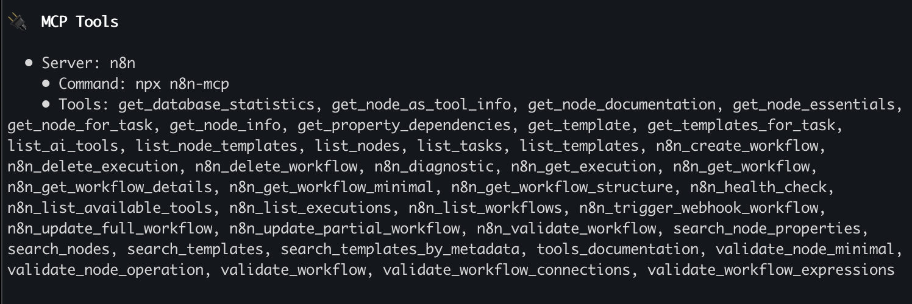

# Codex Setup

Connect n8n-MCP to Codex for enhanced n8n workflow development.

## Update your Codex configuration

Go to your Codex settings at `~/.codex/config.toml` and add the following configuration:

### Basic configuration (documentation tools only):
```toml
[mcp_servers.n8n]
command = "npx"
args = ["n8n-mcp"]
env = { "MCP_MODE" = "stdio", "LOG_LEVEL" = "error", "DISABLE_CONSOLE_OUTPUT" = "true" }
```

### Full configuration (with n8n management tools):
```toml
[mcp_servers.n8n]
command = "npx"
args = ["n8n-mcp"]
env = { "MCP_MODE" = "stdio", "LOG_LEVEL" = "error", "DISABLE_CONSOLE_OUTPUT" = "true", "N8N_API_URL" = "https://your-n8n-instance.com", "N8N_API_KEY" = "your-api-key" }
```

Make sure to replace `https://your-n8n-instance.com` with your actual n8n URL and `your-api-key` with your n8n API key.

## Managing Your MCP Server
Enter the Codex CLI and use the `/mcp` command to see server status and available tools.



## Project Instructions

For optimal results, create a `AGENTS.md` file in your project root with the instructions same with [main README's Claude Project Setup section](../README.md#-claude-project-setup).
