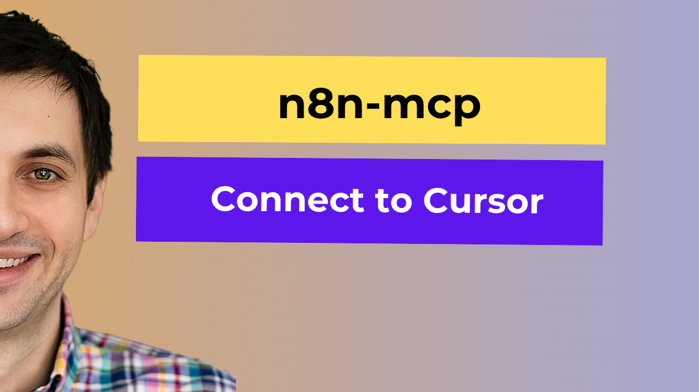

# Cursor Setup

Connect n8n-MCP to Cursor IDE for enhanced n8n workflow development with AI assistance.

[](https://www.youtube.com/watch?v=hRmVxzLGJWI)

## Video Tutorial

Watch the complete setup process: [n8n-MCP Cursor Setup Tutorial](https://www.youtube.com/watch?v=hRmVxzLGJWI)

## Setup Process

### 1. Create MCP Configuration

1. Create a `.cursor` folder in your project root
2. Create `mcp.json` file inside the `.cursor` folder
3. Copy the configuration from this repository

**Basic configuration (documentation tools only):**
```json
{
  "mcpServers": {
    "n8n-mcp": {
      "command": "npx",
      "args": ["n8n-mcp"],
      "env": {
        "MCP_MODE": "stdio",
        "LOG_LEVEL": "error",
        "DISABLE_CONSOLE_OUTPUT": "true"
      }
    }
  }
}
```

**Full configuration (with n8n management tools):**
```json
{
  "mcpServers": {
    "n8n-mcp": {
      "command": "npx",
      "args": ["n8n-mcp"],
      "env": {
        "MCP_MODE": "stdio",
        "LOG_LEVEL": "error",
        "DISABLE_CONSOLE_OUTPUT": "true",
        "N8N_API_URL": "https://your-n8n-instance.com",
        "N8N_API_KEY": "your-api-key"
      }
    }
  }
}
```

### 2. Configure n8n Connection

1. Replace `https://your-n8n-instance.com` with your actual n8n URL
2. Replace `your-api-key` with your n8n API key

### 3. Enable MCP Server

1. Click "Enable MCP Server" button in Cursor
2. Go to Cursor Settings
3. Search for "mcp"
4. Confirm MCP is working

### 4. Set Up Project Instructions

1. In your Cursor chat, invoke "create rule" and hit Tab
2. Name the rule (e.g., "n8n-mcp")
3. Set rule type to "always"
4. Copy the Claude Project instructions from the [main README's Claude Project Setup section](../README.md#-claude-project-setup)

