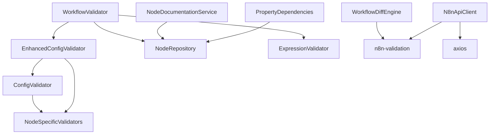

# Mocking Strategy for n8n-mcp Services

## Overview

This document outlines the mocking strategy for testing services with complex dependencies. The goal is to achieve reliable tests without over-mocking.

## Service Dependency Map



## Mocking Guidelines

### 1. Database Layer (NodeRepository)

**When to Mock**: Always mock database access in unit tests

```typescript
// Mock Setup
vi.mock('@/database/node-repository', () => ({
  NodeRepository: vi.fn().mockImplementation(() => ({
    getNode: vi.fn().mockImplementation((nodeType: string) => {
      // Return test fixtures based on nodeType
      const fixtures = {
        'nodes-base.httpRequest': httpRequestNodeFixture,
        'nodes-base.slack': slackNodeFixture,
        'nodes-base.webhook': webhookNodeFixture
      };
      return fixtures[nodeType] || null;
    }),
    searchNodes: vi.fn().mockReturnValue([]),
    listNodes: vi.fn().mockReturnValue([])
  }))
}));
```

### 2. HTTP Client (axios)

**When to Mock**: Always mock external HTTP calls

```typescript
// Mock Setup
vi.mock('axios');

beforeEach(() => {
  const mockAxiosInstance = {
    get: vi.fn().mockResolvedValue({ data: {} }),
    post: vi.fn().mockResolvedValue({ data: {} }),
    put: vi.fn().mockResolvedValue({ data: {} }),
    delete: vi.fn().mockResolvedValue({ data: {} }),
    patch: vi.fn().mockResolvedValue({ data: {} }),
    interceptors: {
      request: { use: vi.fn() },
      response: { use: vi.fn() }
    },
    defaults: { baseURL: 'http://test.n8n.local/api/v1' }
  };
  
  (axios.create as any).mockReturnValue(mockAxiosInstance);
});
```

### 3. Service-to-Service Dependencies

**Strategy**: Mock at service boundaries, not internal methods

```typescript
// Good: Mock the imported service
vi.mock('@/services/node-specific-validators', () => ({
  NodeSpecificValidators: {
    validateSlack: vi.fn(),
    validateHttpRequest: vi.fn(),
    validateCode: vi.fn()
  }
}));

// Bad: Don't mock internal methods
// validator.checkRequiredProperties = vi.fn(); // DON'T DO THIS
```

### 4. Complex Objects (Workflows, Nodes)

**Strategy**: Use factories and fixtures, not inline mocks

```typescript
// Good: Use factory
import { workflowFactory } from '@tests/fixtures/factories/workflow.factory';
const workflow = workflowFactory.withConnections();

// Bad: Don't create complex objects inline
const workflow = { nodes: [...], connections: {...} }; // Avoid
```

## Service-Specific Mocking Strategies

### ConfigValidator & EnhancedConfigValidator

**Dependencies**: NodeSpecificValidators (circular)

**Strategy**: 
- Test base validation logic without mocking
- Mock NodeSpecificValidators only when testing integration points
- Use real property definitions from fixtures

```typescript
// Test pure validation logic without mocks
it('validates required properties', () => {
  const properties = [
    { name: 'url', type: 'string', required: true }
  ];
  const result = ConfigValidator.validate('nodes-base.httpRequest', {}, properties);
  expect(result.errors).toContainEqual(
    expect.objectContaining({ type: 'missing_required' })
  );
});
```

### WorkflowValidator

**Dependencies**: NodeRepository, EnhancedConfigValidator, ExpressionValidator

**Strategy**:
- Mock NodeRepository with comprehensive fixtures
- Use real EnhancedConfigValidator for integration testing
- Mock only for isolated unit tests

```typescript
const mockNodeRepo = {
  getNode: vi.fn().mockImplementation((type) => {
    // Return node definitions with typeVersion info
    return nodesDatabase[type] || null;
  })
};

const validator = new WorkflowValidator(
  mockNodeRepo as any,
  EnhancedConfigValidator // Use real validator
);
```

### N8nApiClient

**Dependencies**: axios, n8n-validation

**Strategy**:
- Mock axios completely
- Use real n8n-validation functions
- Test each endpoint with success/error scenarios

```typescript
describe('workflow operations', () => {
  it('handles PUT fallback to PATCH', async () => {
    mockAxios.put.mockRejectedValueOnce({ 
      response: { status: 405 } 
    });
    mockAxios.patch.mockResolvedValueOnce({ 
      data: workflowFixture 
    });
    
    const result = await client.updateWorkflow('123', workflow);
    expect(mockAxios.patch).toHaveBeenCalled();
  });
});
```

### WorkflowDiffEngine

**Dependencies**: n8n-validation

**Strategy**:
- Use real validation functions
- Create comprehensive workflow fixtures
- Test state transitions with snapshots

```typescript
it('applies node operations in correct order', async () => {
  const workflow = workflowFactory.minimal();
  const operations = [
    { type: 'addNode', node: nodeFactory.httpRequest() },
    { type: 'addConnection', source: 'trigger', target: 'HTTP Request' }
  ];
  
  const result = await engine.applyDiff(workflow, { operations });
  expect(result.workflow).toMatchSnapshot();
});
```

### ExpressionValidator

**Dependencies**: None (pure functions)

**Strategy**:
- No mocking needed
- Test with comprehensive expression fixtures
- Focus on edge cases and error scenarios

```typescript
const expressionFixtures = {
  valid: [
    '{{ $json.field }}',
    '{{ $node["HTTP Request"].json.data }}',
    '{{ $items("Split In Batches", 0) }}'
  ],
  invalid: [
    '{{ $json[notANumber] }}',
    '{{ ${template} }}', // Template literals
    '{{ json.field }}' // Missing $
  ]
};
```

## Test Data Management

### 1. Fixture Organization

```
tests/fixtures/
├── nodes/
│   ├── http-request.json
│   ├── slack.json
│   └── webhook.json
├── workflows/
│   ├── minimal.json
│   ├── with-errors.json
│   └── ai-agent.json
├── expressions/
│   ├── valid.json
│   └── invalid.json
└── factories/
    ├── node.factory.ts
    ├── workflow.factory.ts
    └── validation.factory.ts
```

### 2. Fixture Loading

```typescript
// Helper to load JSON fixtures
export const loadFixture = (path: string) => {
  return JSON.parse(
    fs.readFileSync(
      path.join(__dirname, '../fixtures', path), 
      'utf-8'
    )
  );
};

// Usage
const slackNode = loadFixture('nodes/slack.json');
```

## Anti-Patterns to Avoid

### 1. Over-Mocking
```typescript
// Bad: Mocking internal methods
validator._checkRequiredProperties = vi.fn();

// Good: Test through public API
const result = validator.validate(...);
```

### 2. Brittle Mocks
```typescript
// Bad: Exact call matching
expect(mockFn).toHaveBeenCalledWith(exact, args, here);

// Good: Flexible matchers
expect(mockFn).toHaveBeenCalledWith(
  expect.objectContaining({ type: 'nodes-base.slack' })
);
```

### 3. Mock Leakage
```typescript
// Bad: Global mocks without cleanup
vi.mock('axios'); // At file level

// Good: Scoped mocks with cleanup
beforeEach(() => {
  vi.mock('axios');
});
afterEach(() => {
  vi.unmock('axios');
});
```

## Integration Points

For services that work together, create integration tests:

```typescript
describe('Validation Pipeline Integration', () => {
  it('validates complete workflow with all validators', async () => {
    // Use real services, only mock external dependencies
    const nodeRepo = createMockNodeRepository();
    const workflowValidator = new WorkflowValidator(
      nodeRepo,
      EnhancedConfigValidator // Real validator
    );
    
    const workflow = workflowFactory.withValidationErrors();
    const result = await workflowValidator.validateWorkflow(workflow);
    
    // Test that all validators work together correctly
    expect(result.errors).toContainEqual(
      expect.objectContaining({ 
        message: expect.stringContaining('Expression error') 
      })
    );
  });
});
```

This mocking strategy ensures tests are:
- Fast (no real I/O)
- Reliable (no external dependencies)
- Maintainable (clear boundaries)
- Realistic (use real implementations where possible)